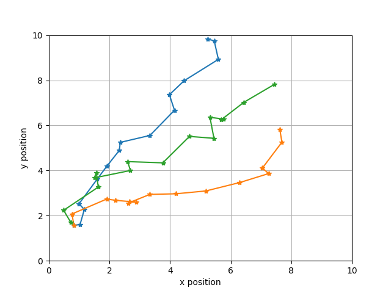
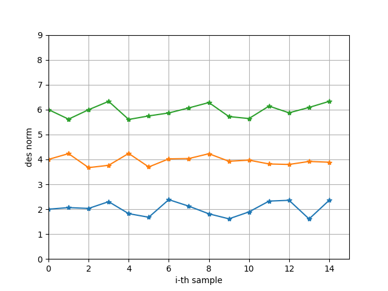
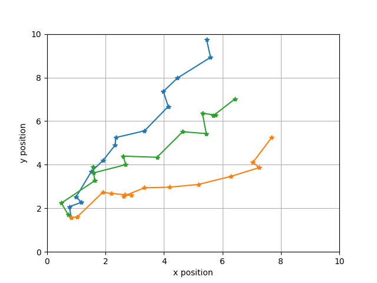
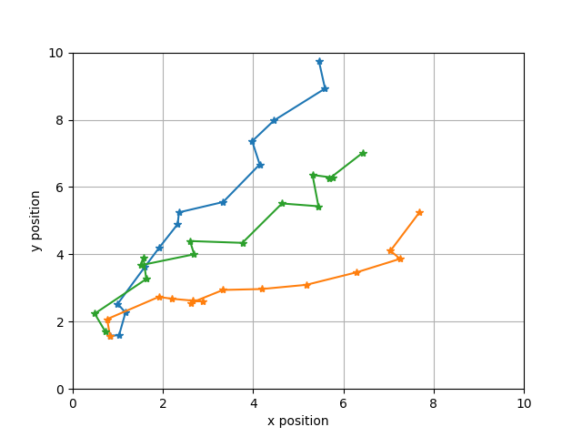

# similarity_tracking
Tracking bboxes using similarity meassures

Esta pequeña demo busca validar conceptualmente un tracking de objetos basado en un detector (bbox) y un modelo descriptor (descriptor). La idea es minimizar el error al re-asignar los bboxes detectados en el frame actual al compararlos con el frame anterior. El error puede ser definido como la norma de la diferencia entre posiciones entre bboxes, pero tambien puedes ser incorporado el error en la diferencia de vectores descritpores. 

La hipotesis subyacente es que minimzar el error en la posicion es suceptible a confusiones de objetos. En cambio esa confusion es minimizada al incorporar la medida de distancia entre vectores descriptores en cada frame y camparalo con los frames anteriores

***La asignacio entre el frame actual y el anterior se hace con el método hungaro.***. 

## Ejemplo de uso en una caminata aleatoria 

Esta caminata esa aleatoria, pero esta segada hacia la esquina sup der.

Trayectoria de posición real

Trayectoria de descriptores real

Trayectoria estimada minimzando el error en la posición

Trayectoria estimada minimzando el error en el descriptor

Como se puede apreciar la minimización del error en el descriptor es superior al minimzar el error en la posición. ***Obviamente esto que los objetos detectados son disimiles a nivel de descriptores***. Esto es razonable en el caso de objetos de naturaleza distinta (una manzana y un zapato), pero no lo sería tanto en caso de objetos iguales (dos manzanas).