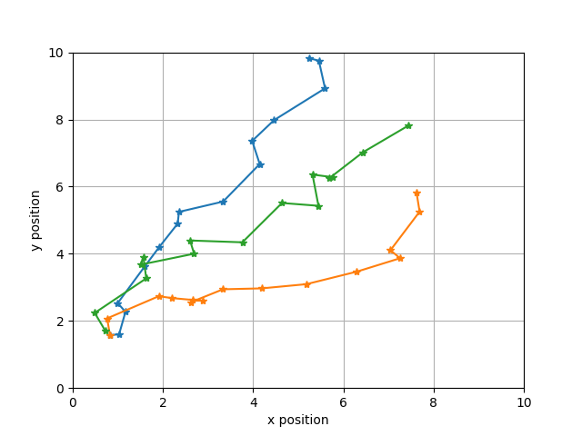
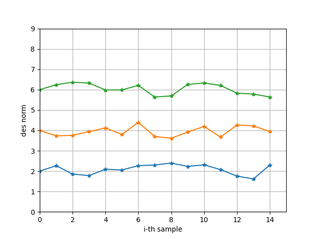
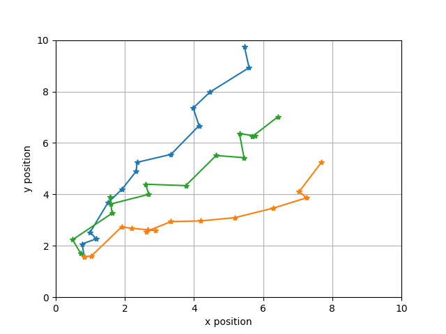
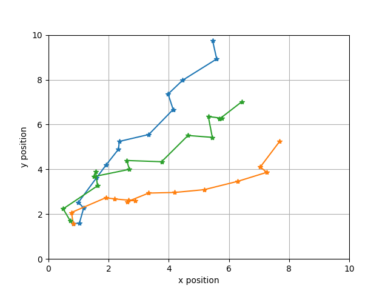

# similarity_tracking
Tracking bboxes using similarity meassures

Esta pequeña demo busca demostrar conceptualmente un tracking de objetos basado en un detector y un modelo descriptor. La idea es minimizar el error al asignar las detecciones en el instante actual respecto al anterior. En los trackings tradicionales, el error es definido como la norma de la diferencia entre posiciones de instantes consecutivos. 

***La hipotesis principal es que solo minimzar el error en la posicion es suceptible a confusiones de objetos cercanos, esto produce "robos de ID". En vez de mitigar esto con metodos geométricos o dinámicos, tal confusion busca ser minimizada incorporando un vector descriptor del objeto***. 

Existe un segundo tipo de error producido al ocluirse la vista de un objeto (desaparecer, esconderse, taparse, etc). Los trackings tradicionales definen un "tiempo de vida" del objeto, luego del cual se genera un nuevo ID al objeto "oculto, olvidado y luego resucitado". Esta segunda falencia también puede ser resuelta por este metodo si le sumamos algún otro modelo de aparación/desaparición, pero su planteamiento formal queda para el futuro.  

## Explicación

Primero que todo, hay varios supuestos subyacentes:
- La variación entre instantes (frames) es pequeña, de manera que tanto la posición de los objetos como su descripción no varia demasiado. 
- Cada objeto visible genera una sola detección (un solo bbox) y el número de detecciones es igual al número de objetos.
- Se asume además que el vector descriptor de cada objeto está lo suficientemente alejado de los demás, de manera que la distancia entre instantes sea menor que la distancia entre un objeto y otro.

Obviamente se puede tratar de combinar la distancia en posición y la distancia en descripción de manera de diferenciar dos objetos iguales pero ubicados lejos uno de otro (e.g. dos manzanas), pero esto se deja para otra ocasión.

Los objetos son detectados y pasados al estimador como observaciones. Si la secuencia tiene $m$ instantes (frames) se asume que habrán $m$ observaciónes. Se asume que habiendo $n$ objetos para cada instante (frame) se tendrá un vector $\boldsymbol{v}_j^{i}$ de largo 2 (una imagén es 2D) para posición $(x, y)$ y $d$ en el caso del descriptor de ese objeto (tipicamente 256, 512 o 1024). Por lo tanto el total de observaciones se puede resumir en

$$
\boldsymbol{Y} = 
\begin{bmatrix}
\boldsymbol{y}^{1} & \boldsymbol{y}^{2} & .. & \boldsymbol{y}^{m} \\
\end{bmatrix} =
\begin{bmatrix}
\boldsymbol{v}_1^{1} & \boldsymbol{v}_1^{2} & .. & \boldsymbol{v}_1^{m} \\ 
\boldsymbol{v}_2^{1} & \boldsymbol{v}_2^{2} & .. & \boldsymbol{v}_2^{m} \\ 
.. & .. & .. & .. \\ 
\boldsymbol{v}_n^{1} & \boldsymbol{v}_n^{2} & .. & \boldsymbol{v}_{n}^{m} \\
\end{bmatrix} \in \mathbb{R}^{\ n \times m \times d} \ , \ \boldsymbol{v} \in \mathbb{R}^{\ 1 \times d} 
 $$ 

donde, $n$ es el el número de objetos detectados, $m$ es el número de instantes (frames) y $d$ es el largo del vector (posición o descriptor).

El error entre la observación del instante actual $\boldsymbol{y}^{\ i}$ y el anterior $\boldsymbol{y}^{\ i-1}$ se calcular uno a uno

$$
\boldsymbol{e} = 
\begin{bmatrix}
|| \boldsymbol{v}_1^{\ i} - \boldsymbol{v}_1^{\ i-1} || & || \boldsymbol{v}_2^{\ i} - \boldsymbol{v}_1^{\ i-1} || & .. & || \boldsymbol{v}_n^{\ i} - \boldsymbol{v}_1^{\ i-1} || \\
|| \boldsymbol{v}_1^{\ i} - \boldsymbol{v}_2^{\ i-1} || & || \boldsymbol{v}_2^{\ i} - \boldsymbol{v}_2^{\ i-1}  || & .. & || \boldsymbol{v}_n^{\ i} - \boldsymbol{v}_2^{\ i-1} || \\  
.. & .. & .. & .. \\  
|| \boldsymbol{v}_1^{\ i} - \boldsymbol{v}_n^{\ i-1} || & || \boldsymbol{v}_2^{\ i} - \boldsymbol{v}_n^{\ i-1} || & .. & || \boldsymbol{v}_n^{\ i} - \boldsymbol{v}_n^{\ i-1} || \\ 
\end{bmatrix}
\in \mathbb{R}^{\ n \times n}
$$

La asignación de detecciones entre el instante actual y el anterior, que minimiza el error, se realiza con el método hungaro (también llamado munkres).

## Ejemplo

El siguiente ejemplo ilustra 3 objetos detectados en 15 frames seguidos. Esta caminata esa aleatoria, pero esta sesgada hacia la esquina superior derecha.

Trayectoria real de posición

Trayectoria real de descriptores (norma del vector)

Trayectoria estimada minimzando el error en la posición

Trayectoria estimada minimzando el error en el descriptor

Como se puede apreciar el desempeño de la minimización del error en el descriptor es superior al desempeño de la minimización del error en la posición. Obviamente esto supone que los objetos detectados son disimiles a nivel de descriptores. Esto es razonable en el caso de objetos de naturaleza distinta (una manzana y un zapato), pero no lo sería tanto en caso de objetos iguales (dos manzanas).